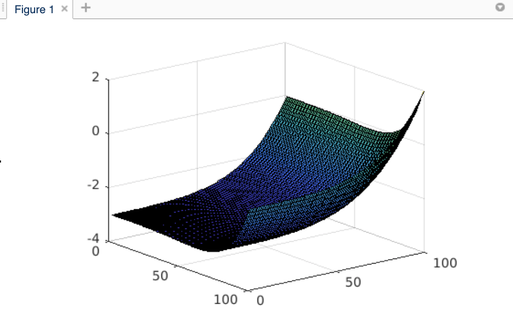

### Author: Luke Sirand

### P.5
    Perform Newton iteration on G(x,y) = 3x^7 + 2y^5 - x^3 + y^3 - 3
    for n iterations and m steps 

### Files

    Newton_plot.py 
        Newton Algorithm
    
    output.txt
        The resulting coordinates after n iterations and m steps

### Plot
    Plugging in plots on Matlab:
    

